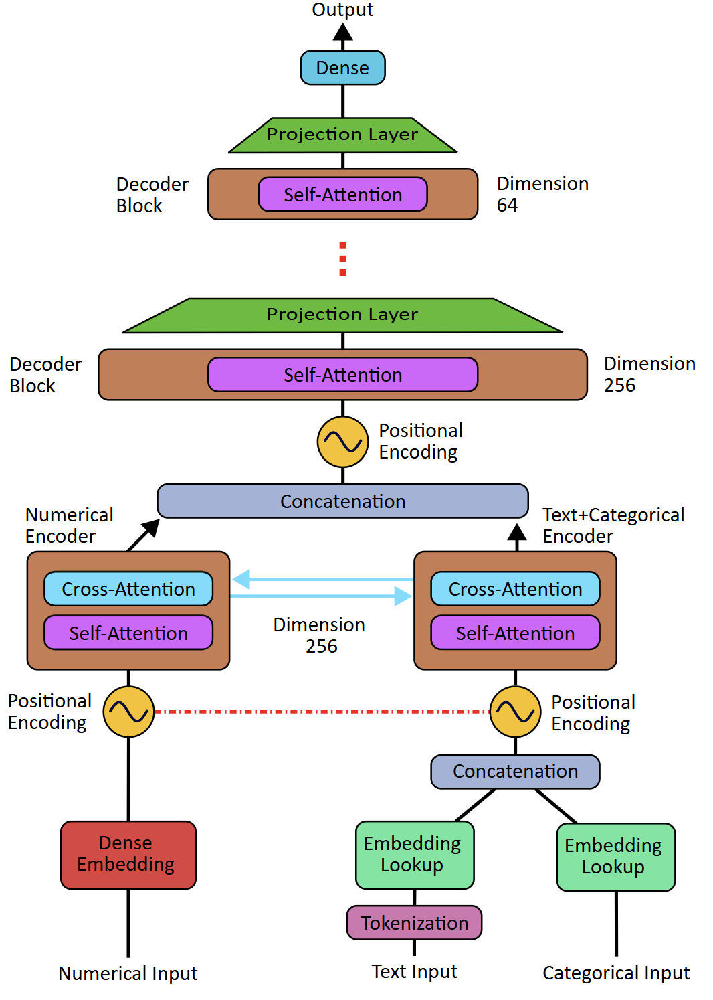

# 🧠 Hierarchical Multimodal Transformer

Custom transformer architecture designed for energy prediction from MRI  
sequence data with interpretable attention mechanisms.

---

## 🎯 Overview
- 🔀 **Multimodal Processing:** Dedicated processing channels for Numerical  
and Text+Categorical data
- 🏗️ **Hierarchical Design:** Progressive dimensionality reduction through  
bottleneck architecture for improved generalization
- 🔗 **Cross-Modal Interaction:** Channels exchange information and learn  
joint representations during processing
- 🧩 **Unified Prediction:** Final representations from both channels are  
combined for energy consumption prediction
- 🧐 **Interpretable Analysis:** Direct access to attention weights enables  
comprehensive feature importance evaluation

---

## 📋 Implementation

**📄 transformer.ipynb**

## 🏗️ Architecture Details

### 🛤️ **Dual-Channel Processing**
- **🔢 Numerical Channel:** Input Projection Layer (Dense Layer) processes  
numerical MRI parameters
- **🔤 Text+Categorical Channel:** Embedding Layer (Look-up Matrix) handles  
textual and categorical features

### 🧠 **Hierarchical Encoder-Decoder Structure**
- **🔄 Encoder Blocks:** Utilize both self-attention and cross-attention  
mechanisms for intra- and inter-modal learning
- **🎯 Decoder Blocks:** Use only self-attention mechanisms to process  
concatenated representations
- **📉 Progressive Reduction:** Model dimensions are systematically reduced  
across Decoder blocks
- **➡️ Projection Layers:** Dense layers between blocks enable controlled  
dimensionality reduction
- **🔗 Channel Fusion:** Encoded latent sequences from both channels are  
concatenated for unified representation

### 🔀 **Cross-Attention in Encoder Blocks**
- 🔄 **Two-Stage Processing:** Encoder blocks are split into two sequential  
stages for proper cross-modal interaction
- 1️⃣ **Stage 1 - Self-Attention:** Each modality (numerical and text+categorical)  
first processes its own features independently through self-attention layers
- 2️⃣ **Stage 2 - Cross-Attention:** After self-attention, both modalities exchange  
information through cross-attention mechanisms
- ⚙️ **Why This Split?** Cross-attention requires the refined representations  
from self-attention as input—each channel must first understand its own features  
before learning relationships across modalities
- 🔗 **Information Flow:** Numerical features attend to text+categorical features,  
and vice versa, enabling bidirectional cross-modal learning

### 🎯 **Output Generation**
- **🎯 Dense Regression Layer:** A fully connected layer maps the flattened  
features to energy consumption predictions
- **📊 Attention Export:** All attention weights are directly accessible for  
comprehensive interpretability analysis

This architecture combines the strengths of multimodal processing with  
hierarchical representation learning, enabling both accurate predictions and  
meaningful insights into MRI parameter relationships.